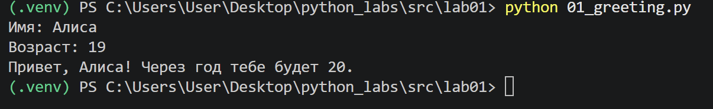
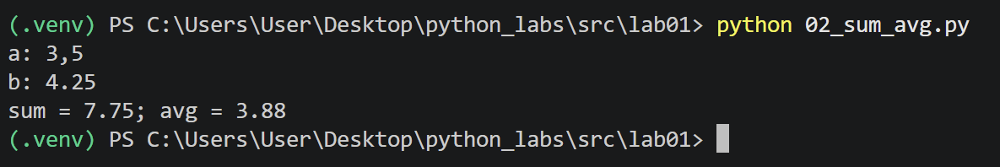
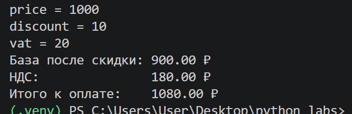
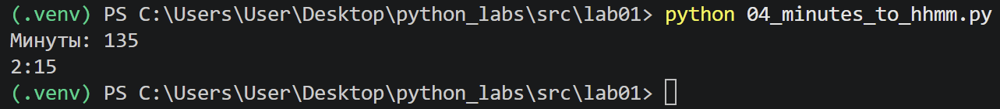
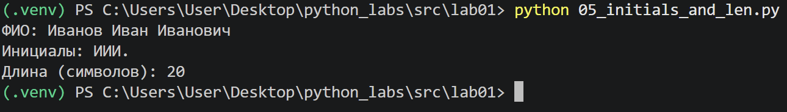
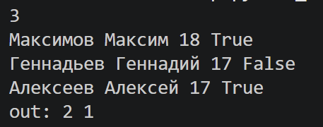
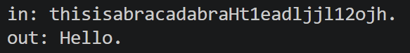

# ЛР1 - Ввод/вывод и форматирование

## Задание 1
Программа запрашивает имя и возраст пользователя, после чего выводит приветствие и возраст пользователя через год.

## Задание 2
Программа выполняет вычисление суммы и среднего арифметического двух введённых вещественных чисел.

## Задание 3
Программа принимает цену товара, размер скидки и ставку НДС, вычисляет стоимость товара с учётом скидки, сумму НДС и итоговую стоимость. Полученные значения выводятся по строкам с точностью до двух знаков после запятой.

## Задание 4
При помощи целочисленного деления определяем количество полных часов, с помощью остатка от деления получаем количество оставшихся минут.

## Задание 5
Вводимое ФИО разбивается на отдельные части. Из перых букв фамилии, имени и отчества при помощи срезов получаем инициалы, переводим их в верхний регистр. Затем подсчитывается длина ФИО с учетом одного пробела между его частями.

## Задание 6
Заводятся счетчики True и False. Вводимые строки разбиваются по пробелу на имя, фамилию, возраст и формат участия. Проверяется только последнее значение, в зависимости от него изменяются впоследствии выводимые значения счетчиков.

## Задание 7
Находятся позиции первой заглавной буквы и первой цифры в строке, по ним определяется шаг. После из строки выбираются символы с нацденным шагом, из них составляется искомое слово. 

