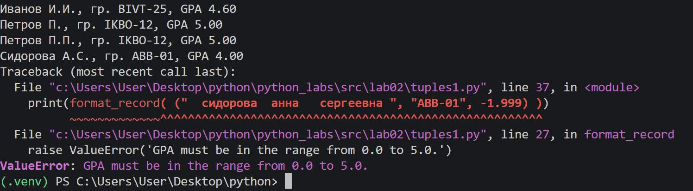

# ЛР2 - Коллекции и матрицы
## Задание A
### 1. min_max
На вход функции подаётся список чисел. Первый элемент списка принимается за начальное значение минимума и максимума, далее с ними сравниваются последующие элементы. При необходимости значения переменных минимума и максимума обновляются. Функция возвращает кортеж, содержащий минимальный и максимальный элементы списка.

```python
def min_max(nums: list[float|int]) -> tuple[float|int, float|int]:
    """
    This function takes a list of numbers (integers or floats) and returns a tuple containing the minimum and maximum values from that list.
    """
    if not nums:
        raise ValueError('The list cannot be empty')
    for _ in nums:
        try:
            float(_)
        except ValueError:
            raise ValueError('The list must contain only numbers')        

    maxnums, minnums = nums[0], nums[0]
    for num in nums:
        if num > maxnums:
            maxnums = num
        elif num < minnums:
            minnums = num
    return minnums, maxnums

#test cases
print(min_max([3,-1,5,5,0]))
print(min_max([42]))
print(min_max([-5,-2,-9]))
print(min_max([1.5,2,2.0,-3.1]))
print(min_max([]))
```


### 2. unique_sorted

Вследствие запрета на встроенную сортировку используется "пузырьковая сортировка" (выполняется некоторое количество проходов по массиву с перебором пар соседних элементов до момента, пока значения не встанут в необходимом порядке).  
На вход функции подается список чисел. Далее создается пустой результирующий список, в который добавляются значения из входного при условии, что они в нём не повторяются. Функция возвращает результирующий список, отсортированный при помощи пузырьковым методом.

```python
def bubble_sort(nums: list[float|int]) -> list[float|int]:
    """
    This function takes a list of numbers (integers or floats) and sorts it in ascending order using the bubble sort algorithm.
    """
    for i in range(len(nums)):
        for j in range(0, len(nums) - i - 1):
            if nums[j] > nums[j + 1]:
                nums[j], nums[j + 1] = nums[j + 1], nums[j]
    return nums

def unique_sorted(nums: list[float|int]) -> list[float|int]:
    """
    This function returns a sorted list of numbers (integers or floats) with duplicates removed.
    """
    for _ in nums:  
        try:
            float(_)
        except ValueError:
            raise ValueError('The list must contain only numbers')

    unique_nums = []
    for num in nums:
        if num not in unique_nums:
            unique_nums.append(num)

    unique_sorted_nums = bubble_sort(unique_nums)
    return unique_sorted_nums

#test cases
print(unique_sorted([3, 1, 2, 1, 3]))
print(unique_sorted([-1,-1,0,2,2]))
print(unique_sorted([]))
print(unique_sorted([1.0,1,2.5,2.5,0]))
```


### 3. flatten

Функция получает на вход несколько списков или кортежей. Далее элементы объединяются в результирующий список, который возвращает функция. 

```python
def flatten(mat: list[list|tuple]) -> list:
    """
    This function returns a flattened version of matrix as a single list.
    """
    if not mat:
        raise ValueError('The matrix cannot be empty')
    res = []
    for row in mat:
        if not isinstance(row, (list, tuple)):
            raise TypeError('Each row must be a list or tuple')
        for el in row:
            res.append(el)
    return res
#test cases
print(flatten([[1, 2], [3, 4]]))
print(flatten([[1, 2], (3,4,5)]))
print(flatten([[1], [], [2,3]]))
print(flatten([[1, 2], 'ab']))
```


## Задание B
### helper functions
Функция для проверки прямоугольности матрицы.
```python
def check_rec_mat(mat: list[list[int]]):
    """
    This function checks if the matrix is rectangular.
    """
    if not mat:
        return False
    for row in mat:
        if not isinstance(row, list):
            raise ValueError("Matrix must be a list of lists")
        if len(row) != len(mat[0]):
            return False
    return True
```
Функция для проверки типов элементов матрицы.
```python
def check_values(mat: list[list[int]]):
    """
    This function checks if all values in the matrix are floats or integers.
    """
    for row in mat:
        for el in row:
            if not isinstance(el, (float, int)):
                raise ValueError("Matrix must contain only floats or integers")
```
### transpose
Функция принимает на вход матрицу, представляющую собой список списков. Далее матрица проверяется на прямоугольность и тип элементов.\
Создается новая матрица. Для каждого столбца исходной матрицы создается строка в новой. В неё последовательно добавляются элементы этого столбца из каждой строки исходной матрицы. Полученные строки добавляются в новую матрицу, в результате чего исходная матрица транспонируется. 
```python
def transpose(mat: list[list[int]]) -> list[list[int]]:
    """
    This function transposes the given matrix.
    """
    if len(mat) == 0:
        return []
    if not check_rec_mat(mat):
        raise ValueError("Matrix is not rectangular")
    check_values(mat)
    new_mat = []
    for i in range(len(mat[0])):
        new_row = []
        for j in range(len(mat)):
            new_row.append(mat[j][i])
        new_mat.append(new_row)
    return new_mat

#test cases
print(transpose([[1,2,3]]))
print(transpose([[1],[2],[3]]))
print(transpose([[1,2], [3,4]]))
print(transpose([]))
print(transpose([[1,2],[3]]))
```


### row_sums
Функция принимает на вход матрицу, представляющую собой список списков. Далее матрица проверяется на прямоугольность и тип элементов. \
Функция возвращает список, в который последовательно добавлены суммы строк матрицы.
```python
def row_sums(mat: list[list[float|int]]) -> list[float]:
    """
    This function calculates the sum of each row in the given matrix.
    """
    if not check_rec_mat(mat):
        raise ValueError("Matrix is not rectangular")
    check_values(mat)
    res = [sum(row) for row in mat]
    return res

#test cases
print(row_sums([[1, 2, 3], [4, 5, 6]]))
print(row_sums([[-1,1], [10,-10]]))
print(row_sums([[0,0], [0,0]]))
print(row_sums([[1, 2], [3]]))
```


### col_sums
Функция принимает на вход матрицу, представляющую собой список списков. Далее матрица проверяется на прямоугольность и тип элементов. \
Функция возвращает список, в который последовательно добавлены суммы столбцов матрицы. Для вычисления суммы последовательно складываются элементы каждой строки, имеющие одинаковый индекс.
```python
def col_sums(mat: list[list[float|int]]) -> list[float]:
    """
    This function calculstes the sum of each column in the given matrix.
    """
    if not check_rec_mat(mat):
        raise ValueError("Matrix is not rectangular")
    check_values(mat)
    res = [sum(row[i] for row in mat) for i in range(len(mat[0]))]
    return res

#test cases
print(col_sums([[1, 2,3], [4,5,6]]))
print(col_sums([[-1,1], [10,-10]]))
print(col_sums([[0,0], [0,0]]))
print(col_sums([[1, 2], [3]]))
```


## Задание C

Функция принимает на вход запись студента, представленную в виде кортежа, содержащего ФИО, группу и GPA. Проверяется корректность количества элементов записи, ФИО и группы, а также тип и диапазон значения GPA. Из ФИО выделяется фамилия и формируются инициалы имени и отчества.
Фунция возвращает строку с фамилией, инициалами, группой и GPA, округленным до двух знаков после запятой. 

```python
def format_record(rec: tuple[str, str, float]) -> str:
    """
    Returns a formatted string containing a student's last name, initials, group, and GPA.
    Raises:
    ValueError: If the record does not contain three elements,
        the full name is empty or invalid, the group is empty,
        or the GPA is outside the range from 0.0 to 5.0.
    TypeError: If GPA is not a number.
    """
    if len(rec) != 3:
            raise ValueError('Record must contain 3 elements: full name, group, and GPA. Check that you have entered all the necessary information, separated by commas.')

    fio, group, gpa = rec
    fio = fio.strip()
    group = group.strip()
    
    if not fio:
        raise ValueError('Full name cannot be empty')
    name_parts = fio.split()
    if len(name_parts) not in (2, 3):
        raise ValueError('Full name must contain at least Surname and First name')
    surname = name_parts[0].capitalize()
    initials = ''.join(part[0].upper() + '.' for part in name_parts[1:])
    
    if not group:
        raise ValueError('Group cannot be empty')
  
    if not isinstance(gpa, (int, float)):
        raise TypeError('GPA must be a number.')
    if not 0.0 <= gpa <= 5.0:
        raise ValueError('GPA must be in the range from 0.0 to 5.0.')
    
    return f'{surname} {initials}, гр. {group}, GPA {gpa:.2f}'

#test cases
print(format_record( ("Иванов Иван Иванович", "BIVT-25", 4.6) ))
print(format_record( ("Петров Пётр", "IKBO-12", 5.0) ))
print(format_record( ("Петров Пётр Петрович", "IKBO-12", 5.0) ))
print(format_record( ("  сИдОРова  анна   сергеевна ", "ABB-01", 3.999) ))
print(format_record( ("  сидорова  анна   сергеевна ", "ABB-01", -1.999) ))
```
