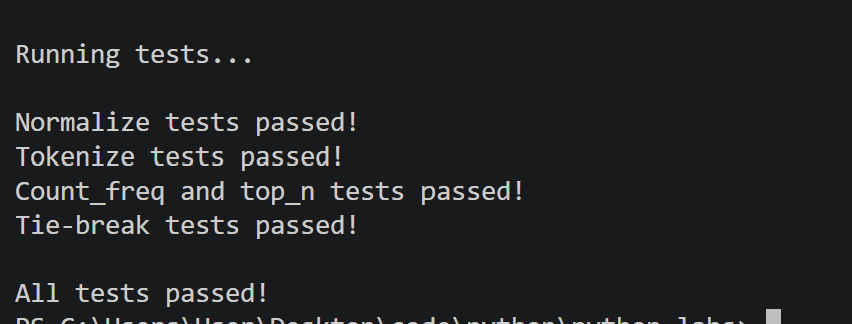
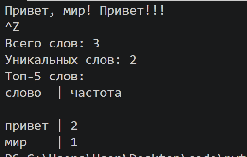
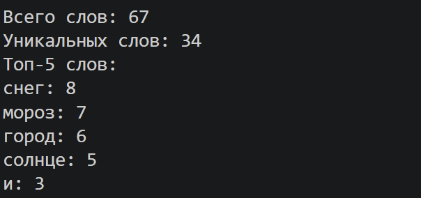

# ЛР3 - Тексты и частоты слов (словарь/множество)
## Задание A
### 1. normalize
Функция предназначена для приведения текста к единому виду перед дальнейшей обработкой. Она переводит текст в нижний регистр, заменяет символ 'ё' на 'е', преобразует табуляции и символы возврата каретки в обычные пробелы, а также удаляет лишние пробелы. 
```python
def normalize(text: str, *, casefold: bool = True, yo2e: bool = True) -> str:
    '''
    This function normalizes the input text. It performs the following operations:
    1. Converts the text to lowercase.
    2. Replaces the character 'ё' with 'е'.
    3. Replaces tabs and carriage returns with spaces.
    4. Collapses multiple spaces into a single space.
    '''
    if casefold:
        text = text.casefold()
    if yo2e:
        text = text.replace('ё', 'е')
    text = text.replace('\t', ' ').replace('\r', ' ')
    text = text.strip()
    text = ' '.join(text.split())
    return text
```

### 2. tokenize
Функция предназначена для разделения нормализованного текста на отдельные токены. При помощи регулярного выражения `r"\w+(?:-\w+)*"` она находит последовательности букв и цифр и сохраняет дефис внутри слов. Результатом является список найденных токенов.
```python
import re

def tokenize(text: str) -> list[str]:
    '''
    This function tokenizes the input text into a list of words.
    '''
    pattern = r"\w+(?:-\w+)*"
    return re.findall(pattern, text)
```


### 3. count_freq
Функция предназначена для подсчёта количества появлений каждого токена в списке. Для каждого элемента создается запись в словаре, для которого ключ - токен, а значение - число повторений. Результатом является словарь с частотами токенов.
```python
def count_freq(tokens: list[str]) -> dict[str, int]:
    '''
    This function counts the frequency of each token in the input list of tokens.
    '''
    freq = {}
    for token in tokens:
        freq[token] = freq.get(token, 0) + 1
    return freq
```


### 4. top_n
Функция предназначена для определения наиболее часто встречающихся токенов. Элементы сортируются в порядке убывания количества, при его равенстве - в алфавитном порядке. Результатом является указанное количество наиболее частых токенов.
```python
def top_n(freq: dict[str, int], n: int = 5) -> list[tuple[str, int]]:
    '''
    This function returns the top n most frequent tokens fron the input frequency dictionary.
    '''
    return sorted(freq.items(), key=lambda x: (-x[1], x[0]))[:n]
```
### мини-тесты для функций
```python
if __name__ == "__main__":
    print("\nRunning tests...")

    # normalize
    assert normalize("ПрИвЕт\nМИр\t") == "привет мир"
    assert normalize("ёжик, Ёлка") == "ежик, елка"
    print("\nNormalize tests passed!")

    # tokenize
    assert tokenize("привет, мир!") == ["привет", "мир"]
    assert tokenize("по-настоящему круто") == ["по-настоящему", "круто"]
    assert tokenize("2025 год") == ["2025", "год"]
    print("Tokenize tests passed!")

    # count_freq + top_n
    freq = count_freq(["a","b","a","c","b","a"])
    assert freq == {"a":3, "b":2, "c":1}
    assert top_n(freq, 2) == [("a",3), ("b",2)]
    print("Count_freq and top_n tests passed!")

    # тай-брейк по слову при равной частоте
    freq2 = count_freq(["bb","aa","bb","aa","cc"])
    assert top_n(freq2, 2) == [("aa",2), ("bb",2)]
    print("Tie-break tests passed!")

    print("\nAll tests passed!")
```
\
*результат мини-тестов для функций*

## Задание B
### text_stats
Программа считывает текст из стандартного ввода, проверяет на наличие содержимого. Далее выполняется нормализация, токенизация и подсчёт частот слов. Определяется количество всех и уникальных токенов, а также пять наиболее часто встречающихся. Результат выводится построчно или в виде таблицы в зависимости от значения table_flag.
```python
from src.lib.text import normalize, tokenize, count_freq, top_n
import sys

table_flag = 1
raw_text = sys.stdin.read()
if raw_text.strip() == "":
    raise ValueError("Input text is empty.")

normalized_text = normalize(raw_text)
tokens = tokenize(normalized_text)
unique_tokens = set(tokens)
freq = count_freq(tokens)
top_tokens = top_n(freq, n=5)

print('Всего слов:', len(tokens))
print('Уникальных слов:', len(unique_tokens))
print('Топ-5 слов:')

if not table_flag:
    for token, count in top_tokens:
        print(f'{token}: {count}')

else:
    max_token_length = max(len(token) for token, _ in top_tokens)
    print(f"{'слово':<{max_token_length}} | {'частота'}")
    print('-' * (max_token_length + 12))
    for token, count in top_tokens:
        print(f'{token:<{max_token_length}} | {count}')
```
\
*тест из ТЗ, результат в виде таблицы*

\
*вывод результата в виде таблицы*

\
*вывод результата построчно*